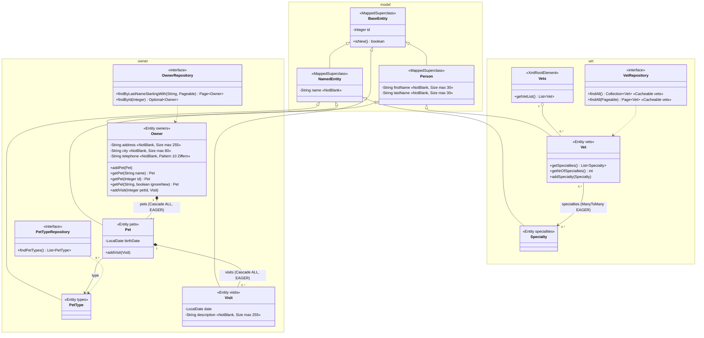
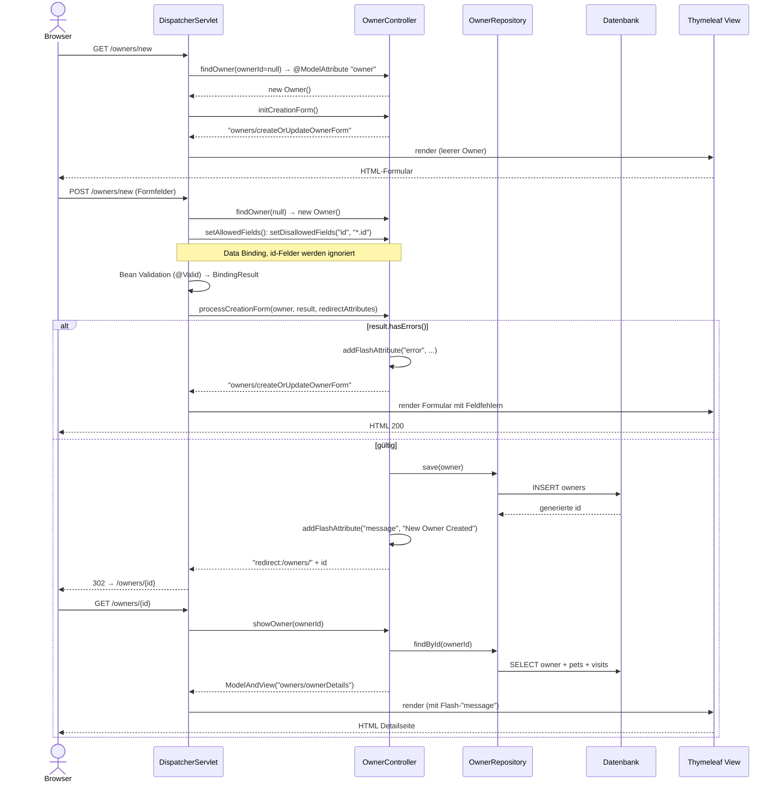

# Architektur: Datenmodell und Ablauf "Neuen Besitzer anlegen"

Stand: 2026-10-09, Branch `harness/setup`.
Quelle: Lauf des explorer-Agenten (nur lesend) über die Pakete `model`, `owner` und `vet`;
die zentralen Stellen im `OwnerController` wurden in der Hauptsitzung nachgelesen.
Nicht geprüft: Thymeleaf-Templates und `db/*/schema.sql` (Spaltenlängen und Fremdschlüssel
sind nur aus den Annotationen abgeleitet).

## Klassendiagramm: Datenmodell (`model`, `owner`, `vet`)

Getter, Setter, Controller, `PetValidator` und `PetTypeFormatter` sind bewusst weggelassen.

Quellen: `model/BaseEntity.java`, `model/NamedEntity.java`, `model/Person.java`, `owner/Owner.java`, `owner/Pet.java`, `owner/PetType.java`, `owner/Visit.java`, `owner/OwnerRepository.java`, `owner/PetTypeRepository.java`, `vet/Vet.java`, `vet/Specialty.java`, `vet/Vets.java`, `vet/VetRepository.java` (alle unter `src/main/java/org/springframework/samples/petclinic/`).

## Sequenzdiagramm: Neuen Besitzer anlegen

Quellen: `src/main/java/org/springframework/samples/petclinic/owner/OwnerController.java` (Zeilen 59-62, 64-70, 72-75, 77-87, 178-186).
